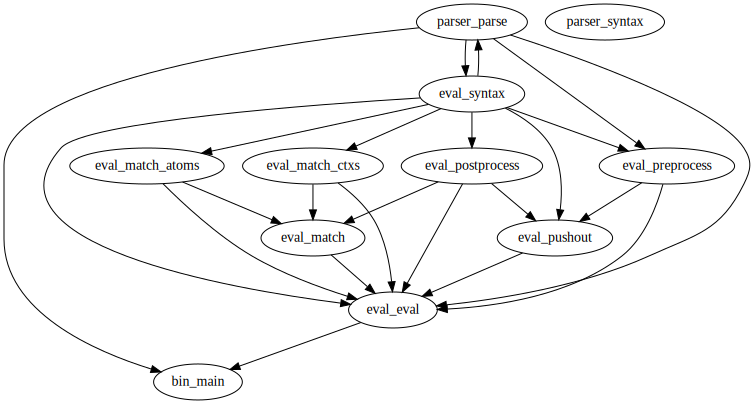

# A Reference Interpreter of the Lambda GT Language

[](#license)
[](https://twitter.com/sano_jn)

We designed a new purely functional language, λGT,
that handles graphs as immutable, first-class data structures with
a pattern matching mechanism based on graph transformation.
Here, we implemented a reference interpreter of the language.
The interpreter is written in only about 500 lines of OCaml code.

We also have [a visualiser that runs on a browser](https://sano-jin.github.io/lambda-gt-playground/).

## Memo

このリポジトリは，
visualiser に渡すために JSON へ変換するコードと，
javascript として解釈実行するためのコードを含んでいる．

TODO: それぞれの使い方を整理してまとめる．

visualiser のために，アトムに id を振っているけど，
この id は不要かも知れない．
現状の visualiser は使っていないはず．
コードを綺麗にするために，これを削除するのはありかも．
どうしても必要になったら，Magic で物理アドレスを取得してそれを使えば良い？

## Getting Started

### Prerequisites

- [opam](https://opam.ocaml.org/)

### Installation

```bash
git clone https://github.com/sano-jin/lambda-gt-alpha.git
cd lambda-gt-alpha
opam install .
dune build
```

## Usage

```bash
./run example/dlist.lgt
```

which will result in `{_Y >< _X}`.

See [/example](example) for more examples.

## Syntax

```
Expression     e ::= { T }                                     // Graph
                  |  e1 e2                                     // Application
                  |  case e1 of { T } -> e2 | otherwise -> e3  // Case Expression
                  |  e1 + e2
                  |  e1 * e2
                  |  e1 - e2

                  // Definition (n >= 0)
                  |  let x[_X1, ..., _Xm] x_1[_X1_1, ..., _X1_m] ... x_n[_Xn_m, ..., _Xn_m] = e1 in e2

                  // Recursive Definition (n >= 1)
                  |  let rec x[_X1, ..., _Xm] x_1[_X1_1, ..., _X1_m] ... x_n[_Xn_m, ..., _Xn_m] = e1 in e2


Graph Template T ::= v (_X1, ..., _Xn)                      // Atom
                  |  _X >< _Y                               // Fusion
                  |  x[_X1, ..., _Xn]                       // Graph Context
                  |  (T, T)                                 // Molecule
                  |  nu _X. T                               // Link Creation

Atom Name      v ::= Constr                                 // Constructor Name
                  |  (\x[_X1, ..., _Xn]. e)                 // Lambda Abstraction
```

For the semantics, please see
<https://doi.org/10.2197/ipsjjip.31.112>.

We have enabled logging.
`{Log} exp` evaluates `exp`, prints the value, and returns the value; i.e., an identity function.

## Development



Please give me issues or pull requests if you find any bugs or solutions for them.

We aim to build the simplest implementation.
Thus, we may not accept a request for an enhancement.
However, we appreciate it because it will be helpful in the design and implementation
of the full-fledged language based on this PoC.

### Testing

```bash
dune runtest
```

See [test/test.ml](test/test.ml) for more information.

- Configure tests with the file.

### Directory Structures

[/bin](bin):
entry point

| File                   | Description                          |
| ---------------------- | ------------------------------------ |
| [main.ml](bin/main.ml) | Read a file and execute the program. |

[/eval](eval):
evaluator

| File                                  | Description                                                                                    |
| ------------------------------------- | ---------------------------------------------------------------------------------------------- |
| [syntax.ml](eval/syntax.ml)           | Syntax of atoms as an list.                                                                    |
| [preprocess.ml](eval/preprocess.ml)   | Transform an AST graph to a list of atoms. Alpha convert link names.                           |
| [eval.ml](eval/eval.ml)               | The evaluator.                                                                                 |
| [match.ml](eval/match.ml)             | Matches atoms and graph contexts and returns the obtained graph substitutions.                 |
| [match_atoms.ml](eval/match_atoms.ml) | Matches atoms and returns the link mappings and the rest graph.                                |
| [postprocess.ml](eval/postprocess.ml) | Transform the link names in the rest graphs and supply fusions according to the link mappings. |
| [match_ctxs.ml](eval/match.ml)        | Matches graph contexts and returns the obtained graph substitutions.                           |
| [pushout.ml](eval/pushout.ml)         | Substitute graph contexts with the given graph substitution (rewriting after matching).        |

[/parser](parser):
lexical/syntactical analyzer

| File                            | Description                   |
| ------------------------------- | ----------------------------- |
| [syntax.ml](parser/syntax.ml)   | AST definition                |
| [lexer.mll](parser/lexer.mll)   | Defines a token for lexing    |
| [parser.mly](parser/parser.mly) | Defines a grammar for parsing |
| [parse.ml](parser/parse.ml)     | Parser                        |

## Contact

Please feel free to contact me (ask me any questions about this).

- [twitter@sano_jn](https://twitter.com/sano_jn)
- [homepage](https://www.ueda.info.waseda.ac.jp/~sano/)

## License

MIT

[repo]: https://github.com/sano-jin/lambda-gt-alpha/tree/icgt2023/
